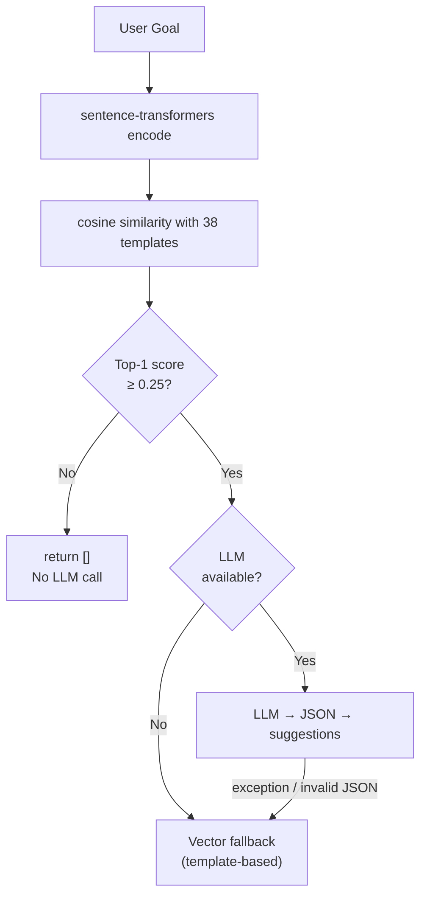
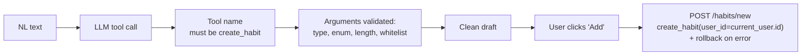

<div align="center">
  <h1>DailyDot</h1>
  <p>
    <strong>Habit tracking with RAG, Function Calling, and AI reports</strong>
  </p>
  <p>
    
    
    
    
  </p>
</div>

---

## Project Overview

DailyDot is a full-stack habit tracking web application with three AI-assisted features:

- **RAG-based habit recommendation** — describe a goal, get structured suggestions
- **Natural-language habit creation** — type "run every morning" → parsed into form fields
- **AI weekly/monthly reports** — aggregated stats → narrative report in 3 tones

Each AI feature has an explicit no-key fallback behavior. RAG recommendations use vector-based template suggestions, reports use a deterministic statistical summary, and natural-language habit parsing returns a not-configured response.

---

## Core Features

### Habit Management
- Create / edit / delete habits (13 icon choices, configurable frequency and time period)
- Daily check-in with timestamp and notes
- Date-specific check-in and undo
- Streak tracking, calendar view, annual heatmap

### Todo Management
- Create / edit / delete todos
- One-click completion toggle
- Sort-by-date listing

### Achievement Cards
- Random image + quote selection (Pexels API with Picsum fallback)
- Canvas screenshot download
- Card gallery

### Statistics Dashboard
- 14-day check-in trend chart (Chart.js)
- Habit completion ranking
- Annual calendar heatmap

---

## AI Capabilities

| Feature | Input | Processing | Output | Fallback |
|---------|-------|------------|--------|----------|
| RAG Recommendation | User goal string | sentence-transformers → cosine similarity → Top-1 relevance gate → LLM | Structured suggestions `[{name, reason}]` | Vector candidates or empty list |
| NL Habit Parsing | Natural-language description | LLM Function Calling → tool name validation → argument validation | Structured field draft | Tool validation error or not-configured message |
| AI Report | Report type + tone | Aggregated DB stats → LLM markdown | HTML report with 3 tone variants | Statistical summary markdown |

### RAG Flow



### Function Calling Safety



Key safety properties:
- The LLM output never directly writes to the database
- Tool name is verified server-side (`create_habit` only)
- Arguments are validated (type, enum membership, length limits, extra-field stripping)
- `user_id` is always `current_user.id` — AI output cannot spoof it
- User explicitly confirms before database write

---

## RAG Evaluation

A project-level evaluation set (16 cases, 38 templates) compares raw dot product with cosine similarity:

| Metric | Raw Dot | Cosine |
|--------|---------|--------|
| Hit@1 | 53.8% | 61.5% |
| Hit@3 | 76.9% | 76.9% |
| MRR | 0.6885 | 0.7308 |
| Relevant Top-1 score (min) | 6.07 | 0.407 |
| Unrelated Top-1 score (max) | 5.29 | 0.181 |

The eval set contains 13 relevant and 3 unrelated queries. Cosine similarity was selected based on these results; the Top-1 relevance threshold (0.25) sits between the positive and negative score distributions. The threshold is an initial value, not an optimal threshold.

These are project-level regression metrics, not general benchmarks.

Full evaluation report: [`docs/RAG_EVAL_BASELINE.md`](docs/RAG_EVAL_BASELINE.md)

---

## Key Design Decisions

**How is retrieval implemented?**
The knowledge base has 38 short habit templates. In-memory NumPy cosine similarity keeps retrieval logic transparent, and adds no infrastructure dependencies. If the template count grows significantly, switching to a dedicated vector store can be evaluated with clear performance data.

**Why does the relevance threshold only check the Top-1 score?**
The project evaluation established a clear Top-1 score gap on the current dataset. The threshold is therefore used only as a Top-1 query-level gate; candidates are not filtered individually after the query passes. The gate rejects clearly irrelevant queries while preserving the full Top-5 list for relevant ones, letting the LLM decide which templates are actually useful.

**How is the AI workflow bounded?**
DailyDot uses per-request single-step AI operations (recommend, parse, report) with explicit validation, deterministic fallbacks, and user confirmation before any database write. Each operation is independent; there is no multi-step agent loop or autonomous execution.

---

## Tech Stack

### Backend
| Technology | Purpose |
|------------|---------|
| Flask 2.3 | Web framework |
| SQLAlchemy 2.0 | ORM |
| Flask-Login | User authentication |
| Flask-WTF | CSRF protection |
| MySQL 8.0 / SQLite | Database (multi-environment) |

### AI / ML
| Technology | Purpose |
|------------|---------|
| sentence-transformers | Multilingual text embeddings |
| NumPy | In-memory cosine similarity |
| OpenAI SDK (compatible) | DeepSeek API for LLM calls |

### Frontend
| Technology | Purpose |
|------------|---------|
| Tailwind CSS | UI framework (CDN) |
| Chart.js | Charts |
| html2canvas | Card screenshot download |

### DevOps
| Technology | Purpose |
|------------|---------|
| Docker + Compose | Containerized deployment |
| Gunicorn | WSGI server |
| GitHub Actions | CI/CD |
| pytest | Test runner |

---

## Getting Started

### Local development (SQLite)

```bash
git clone https://github.com/AriesSure/DailyDot.git
cd dailydot
pip install -r requirements.txt
flask run
```

Open http://localhost:5000

### Docker deployment (MySQL)

```bash
cp .env.example .env
docker-compose up -d --build web
docker-compose exec web flask db upgrade
```

Open http://localhost:5000

### Configuration

Core environment variables:

| Variable | Default | Required for AI features |
|----------|---------|--------------------------|
| `LLM_API_KEY` | — | Yes |
| `LLM_BASE_URL` | `https://api.deepseek.com` | — |
| `LLM_MODEL` | `deepseek-chat` | — |
| `SECRET_KEY` | development default | Always (use a secure value for deployments) |

Without `LLM_API_KEY`:
- `/ai/recommend` returns template-based candidates or empty list
- `/ai/parse-habit` returns "LLM not configured"
- `/ai/report` returns a statistical summary

### API Endpoints

**AI** (`/ai`)
| Method | Path | Purpose |
|--------|------|---------|
| POST | `/ai/recommend` | RAG habit recommendation |
| POST | `/ai/parse-habit` | Natural-language habit parsing |
| GET  | `/ai/report` | AI report generation |

**Habits** (`/habits`)
| Method | Path | Purpose |
|--------|------|---------|
| GET/POST | `/habits/new` | Create habit |
| POST | `/habits/check_in/<id>` | Check in |
| POST | `/habits/delete/<id>` | Delete |
| GET | `/habits/` | List user's habits |

Full API reference and additional endpoints are in the [source blueprints](app/blueprints/).

---

## Testing

```bash
# Run all 147 tests
pytest

# Specific test files
pytest tests/test_ai.py tests/test_ai_baseline.py -v
pytest tests/test_habits.py -v
```

The test suite includes:
- AI behavior baseline (mock-based, no real LLM calls)
- Tool validation and rejection
- RAG similarity and k-guard
- Data isolation (User A cannot see User B's data)
- Offline guard (no real embedding model or LLM in CI)
- Fallback path testing

---

## Limitations

- The RAG evaluation set has 16 cases (13 relevant, 3 unrelated) — adequate for a project-level regression baseline but not a general benchmark
- The embedding model (`paraphrase-multilingual-MiniLM-L12-v2`) runs in-process; no vector database
- The knowledge base contains 38 habit templates; adding new templates requires a code change and embedding rebuild
- Celery-based scheduled reports are partially implemented (generated but not persisted)
- No streaming or async LLM support

---

## Project Structure

```
DailyDot/
├── app/
│   ├── factory.py             # create_app() factory
│   ├── models.py              # User, Habit, Record, Todo, Card
│   ├── ai/
│   │   ├── service.py         # AI orchestration (recommend, parse, report)
│   │   ├── vector_store.py    # sentence-transformers + cosine search
│   │   ├── llm_client.py      # OpenAI-compatible LLM client
│   │   └── prompt_templates.py
│   ├── blueprints/
│   │   ├── habits/ → /habits
│   │   ├── ai/     → /ai
│   │   └── ...
│   ├── services/              # Business logic layer
│   └── templates/             # Jinja2 templates
├── tests/
│   ├── test_ai.py             # 9 offline fallback tests
│   ├── test_ai_baseline.py    # 57 AI behavior tests
│   ├── test_habits.py         # 14 habit CRUD + write safety tests
│   ├── test_vector_store.py   # 19 similarity + k-guard tests
│   └── ...                    # models, auth, todos, cards, client, eval fixture
├── scripts/
│   └── eval_rag.py            # Local RAG evaluation (not in CI)
└── docs/
    ├── AI_ARCHITECTURE_AUDIT.md
    ├── AI_DECISIONS.md
    └── RAG_EVAL_BASELINE.md
```

---

## License

MIT
