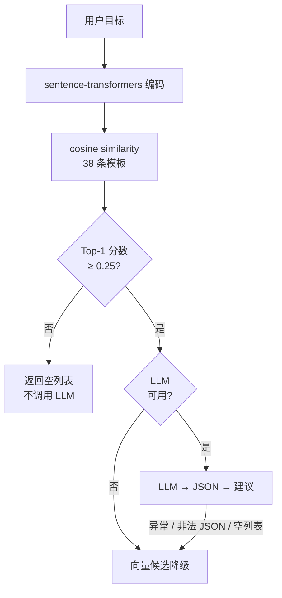
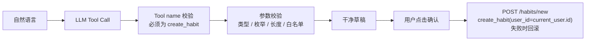

<div align="center">
  <h1>DailyDot</h1>
  <p>
    <strong>基于 RAG、Function Calling 和 AI 报告的习惯管理应用</strong>
  </p>
  <p>
    
    
    
    
  </p>
</div>

---

## 项目简介

DailyDot 是一个全栈习惯管理 Web 应用，集成三项 AI 能力：

- **RAG 习惯推荐**：输入目标 → 语义检索知识库 → LLM 生成结构化建议
- **自然语言习惯解析**：输入「每周一三五早上 7 点跑步」→ LLM Function Calling → 解析为结构化草稿 → 用户确认后创建
- **AI 周报/月报**：自动汇总统计 → LLM 生成分析报告（支持 3 种语气）

所有 AI 功能在未配置 API Key 时均有明确的降级行为：推荐返回模板候选或空列表，解析返回"未配置"提示，报告返回确定性统计摘要。

---

## 核心功能

### 习惯管理
- 创建/编辑/删除习惯（13 种图标，可配置频率和时间段）
- 每日打卡（含备注和时间戳）
- 按日期打卡/取消打卡
- 连续打卡天数统计
- 习惯日历视图 & 年度热力图

### 待办管理
- 创建/编辑/删除待办事项
- 一键完成切换
- 按日期排序查看

### 成就卡片
- 随机图片 + 语录生成（Pexels API，自动降级 Picsum）
- Canvas 截图下载
- 卡片收藏画廊

### 数据统计
- 14 天打卡趋势折线图（Chart.js）
- 习惯完成率排名
- 待办完成率
- 年度日历热力图

---

## AI 能力

| 功能 | 输入 | 处理 | 输出 | 降级 |
|------|------|------|------|------|
| RAG 推荐 | 用户目标文本 | sentence-transformers 编码 → cosine similarity → Top-1 relevance gate → LLM 生成 | 结构化建议 `[{name, reason}]` | 模板候选或空列表 |
| NL 习惯解析 | 自然语言描述 | LLM Function Calling → tool name 校验 → arguments 校验 | 结构化字段草稿 | Tool validation error 或 "LLM not configured" |
| AI 报告 | 报告类型 + 语气 | 聚合 DB 统计 → LLM Markdown 文本 | HTML 报告（3 种语气） | 确定性统计摘要 |

### RAG 工作流



### Function Calling 安全边界



安全特性：

- LLM 输出不直接写入数据库
- Tool name 服务端强制校验（仅允许 `create_habit`）
- 参数校验：类型检查、枚举值、长度限制、多余字段过滤
- `user_id` 始终来自 `current_user.id`，LLM 输出无法伪造
- 用户明确确认后才执行写入

---

## RAG 评估

项目内置离线评估集（16 cases，38 templates），比较 raw dot product 与 cosine similarity：

| 指标 | Raw Dot | Cosine |
|------|---------|--------|
| Hit@1 | 53.8% | 61.5% |
| Hit@3 | 76.9% | 76.9% |
| MRR | 0.6885 | 0.7308 |
| 相关 Top-1 分数（最小） | 6.07 | 0.407 |
| 无关 Top-1 分数（最大） | 5.29 | 0.181 |

评估集含 13 条相关查询和 3 条无关查询。基于此结果选择 cosine similarity；Top-1 relevance threshold（0.25）位于正负分数分布之间，为初始值而非最优阈值。

此为项目级回归基线，非通用 benchmark。

完整报告：[`docs/RAG_EVAL_BASELINE.md`](docs/RAG_EVAL_BASELINE.md)

---

## 关键设计取舍

### 轻量级内存检索

当前知识库包含 38 条短文本习惯模板，使用 NumPy 在内存中计算 cosine similarity。该实现保持检索逻辑透明、轻量且易于测试。若模板数量显著增长，可在获得明确性能数据后评估引入外部向量数据库。

### Top-1 查询级相关性门控

项目内置评估集在 Top-1 分数上呈现清晰的相关/无关分界。threshold 仅作为 Top-1 query-level gate：top-1 分数低于阈值时整个查询被拒绝；通过后完整保留 Top-5 候选列表，不逐项过滤。

### 有边界的 AI 工作流

每项 AI 能力均采用单请求、单职责流程，并通过服务端参数校验、确定性降级和用户确认来约束模型行为边界。各流程相互独立，不存在多步 agent loop 或自主执行。

---

## 技术栈

### 后端
| 技术 | 用途 |
|------|------|
| Flask 2.3 | Web 框架 |
| SQLAlchemy 2.0 | ORM |
| Flask-Login | 用户认证 |
| Flask-WTF | CSRF 保护 |
| MySQL 8.0 / SQLite | 数据库（多环境） |

### AI / ML
| 技术 | 用途 |
|------|------|
| sentence-transformers | 多语言语义 Embedding |
| NumPy | 内存 cosine similarity |
| OpenAI SDK（兼容） | LLM API 调用 |

### 前端
| 技术 | 用途 |
|------|------|
| Tailwind CSS | UI 框架（CDN） |
| Chart.js | 图表 |
| html2canvas | 卡片截图下载 |

### DevOps
| 技术 | 用途 |
|------|------|
| Docker + Compose | 容器化部署 |
| Gunicorn | WSGI 服务器 |
| GitHub Actions | CI/CD |
| pytest | 测试框架 |

---

## 快速开始

### 本地开发（SQLite）

```bash
git clone https://github.com/AriesSure/DailyDot.git
cd dailydot
pip install -r requirements.txt
flask run
```

访问 http://localhost:5000

### Docker 部署（MySQL）

```bash
cp .env.example .env
docker-compose up -d --build web
docker-compose exec web flask db upgrade
```

访问 http://localhost:5000

> 以上命令启动 Web 服务及其 Compose 依赖，不主动启动 Celery worker。

---

## 配置说明

| 变量 | 默认值 | AI 功能需要 |
|------|--------|-------------|
| `LLM_API_KEY` | — | 是 |
| `LLM_BASE_URL` | `https://api.deepseek.com` | — |
| `LLM_MODEL` | `deepseek-chat` | — |
| `SECRET_KEY` | 开发环境有默认值 | 全部环境需要（部署时请替换为安全值） |

未配置 `LLM_API_KEY` 时：

- `/ai/recommend` 返回模板候选或空列表
- `/ai/parse-habit` 返回 "LLM not configured" 提示
- `/ai/report` 返回纯统计摘要

---

## API 端点

**AI** (`/ai`)
| 方法 | 路径 | 用途 |
|------|------|------|
| POST | `/ai/recommend` | RAG 习惯推荐 |
| POST | `/ai/parse-habit` | 自然语言习惯解析 |
| GET  | `/ai/report` | AI 报告生成 |

**习惯** (`/habits`)
| 方法 | 路径 | 用途 |
|------|------|------|
| GET/POST | `/habits/new` | 创建习惯 |
| POST | `/habits/check_in/<id>` | 打卡 |
| POST | `/habits/delete/<id>` | 删除 |
| GET | `/habits/` | 列表 |

完整 API 参见源码 [blueprints](app/blueprints/)。

---

## 测试

```bash
# 运行全部 147 项测试
pytest

# 指定测试文件
pytest tests/test_ai.py tests/test_ai_baseline.py -v
pytest tests/test_habits.py -v
```

测试涵盖：

- AI 行为基线（Mock 实现，不调用真实 LLM）
- Tool 参数校验与拒绝
- RAG 相似度计算与 k guard
- 用户数据隔离（用户 A 不可见用户 B 的数据）
- 离线保护（CI 中不加载真实 Embedding 模型和 LLM）
- Fallback 路径

---

## 当前限制

- RAG 评估集仅含 16 条查询（13 相关 + 3 无关）—— 足够作为项目回归基线，非通用 benchmark
- Embedding 模型（`paraphrase-multilingual-MiniLM-L12-v2`）在进程内运行，无外部向量数据库
- 知识库为 38 条静态模板，新增模板需修改代码并重建 embedding

---

## 项目结构

```
DailyDot/
├── app/
│   ├── factory.py             # create_app() factory
│   ├── models.py              # User, Habit, Record, Todo, Card
│   ├── ai/
│   │   ├── service.py         # AI 编排（推荐/解析/报告）
│   │   ├── vector_store.py    # sentence-transformers + cosine search
│   │   ├── llm_client.py      # OpenAI 兼容 LLM 客户端
│   │   └── prompt_templates.py
│   ├── blueprints/
│   │   ├── habits/ → /habits
│   │   ├── ai/     → /ai
│   │   └── ...
│   ├── services/              # 业务逻辑层
│   └── templates/             # Jinja2 模板
├── tests/
│   ├── test_ai.py             # 9 个离线降级测试
│   ├── test_ai_baseline.py    # 57 个 AI 行为测试
│   ├── test_habits.py         # 14 个习惯 CRUD + 写入安全测试
│   ├── test_vector_store.py   # 19 个相似度 + k guard 测试
│   └── ...
├── scripts/
│   └── eval_rag.py            # 本地 RAG 评估（不在 CI 中运行）
└── docs/
    ├── AI_DECISIONS.md
    └── RAG_EVAL_BASELINE.md
```

---

## License

MIT
