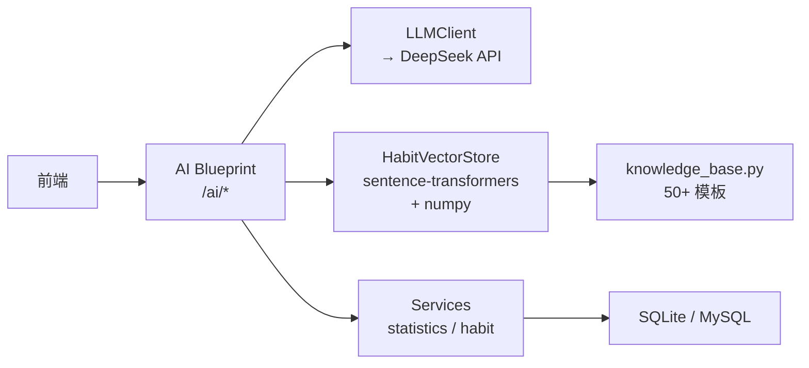
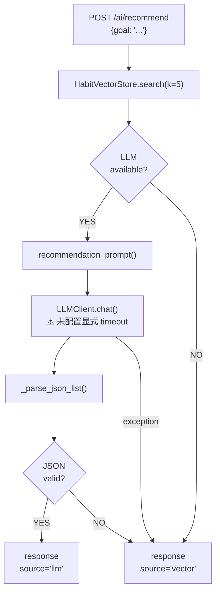

# DailyDot AI 架构审计报告

| | |
|---|---|
| 项目 | DailyDot |
| 日期 | 2026-07-27 |
| 分支 | `upgrade/ai-agent-v2` |
| 任务 | DD-TASK-001 — AI 能力基线审计 |
| 方法 | 静态代码分析，不修改源码 |

---

## 1. 当前架构

### 1.1 应用拓扑

Flask 工厂模式 (`app/factory.py:13`)：

```
create_app(config_name)
  → 加载配置 (development / testing / production)
  → 初始化扩展: db(SQLAlchemy), migrate, login, csrf
  → 注册 7 个 Blueprint
  → 注册错误处理器
```

**7 Blueprints** (`app/factory.py:65-81`)：

| Blueprint | 前缀 | 职责 |
|-----------|------|------|
| auth | `/auth` | 登录/注册/登出/改密 |
| main | `/` | 首页（打卡 + Todo 列表） |
| habits | `/habits` | 习惯 CRUD + 打卡 |
| todos | `/todos` | Todo CRUD |
| cards | `/cards` | 成就卡片（图片 + 语录） |
| stats | `/stats` | 统计看板 + 年度日历 |
| **ai** | **`/ai`** | **RAG 推荐 / NL 解析 / AI 报告** |

**5 Service 模块** (`app/services/`)：habit_service, record_service, todo_service, card_service, statistics_service。所有 Service 通过 `user_id` 参数强制数据隔离。

**5 Model** (`app/models.py`)：User, Habit, Record, Todo, Card。

**3 环境配置** (`app/config.py:50-54`)：

| 环境 | 数据库 | 特点 |
|------|--------|------|
| development | SQLite `app/data/data.sqlite` | `DEBUG=True`, `SQLALCHEMY_ECHO=True` |
| testing | SQLite `:memory:` | `TESTING=True`, CSRF 关闭 |
| production | MySQL (env: `DATABASE_URL`) | |

### 1.2 AI 子系统文件

```
app/ai/
├── llm_client.py          (68行)  LLM 客户端封装
├── prompt_templates.py    (117行) Prompt 字符串 + Tool Schema
├── vector_store.py        (71行)  Embedding + 向量搜索
└── knowledge_base.py      (98行)  50+ 条习惯模板（静态列表）

app/blueprints/ai/
├── __init__.py             (2行)  Blueprint: ai_bp, prefix=/ai
└── routes.py             (209行)  3 个 API 端点

celery_app.py               (92行)  Celery 定时器（可选）
tests/test_ai.py            (62行)  8 个测试
```

**AI 子系统总计**：~555 行应用代码，~62 行测试代码。

### 1.3 AI 数据流总览



---

## 2. 现有 AI 功能

### 2.1 RAG 习惯推荐

**端点**: `POST /ai/recommend` (`routes.py:28-60`) | **认证**: `@login_required`  
**输入**: `{"goal": "..."}` | **输出**: `{success, suggestions, source: "llm"|"vector"}`

**实际流程**：

```
用户提交 goal
  ↓
routes.py:33 — goal.strip()
  ↓
routes.py:37-39 — HabitVectorStore.search(goal, k=5)
  │  vector_store.py:60-71:
  │    sentence-transformers encode(query) → np.dot → argsort → top-5
  │    ⚠ 无条件返回 top-k，无 relevance threshold
  ↓
routes.py:42 — llm.available?
  ├── YES
  │   prompt_templates.py:18-33 — recommendation_prompt(goal, candidates)
  │   → llm_client.py:36-40 — OpenAI SDK chat() [⚠ 未配置显式 timeout 和重试]
  │   → routes.py:63-76 — _parse_json_list() [剥离 fence → json.loads]
  │   → success: source="llm" / failure: → fallback
  └── NO → routes.py:53-60 — 返回原始模板结果, source="vector"
```

**Fallback**（`routes.py:50-60`）：

| 场景 | 行为 |
|------|------|
| LLM_API_KEY 未设置 | 返回向量搜索结果, `source: "vector"` |
| LLM API 抛异常 | `except Exception: pass`，静默降级 |
| LLM 返回非法 JSON | `_parse_json_list()` 返回 None，降级 |



---

### 2.2 NL 习惯解析（Function Calling）

**端点**: `POST /ai/parse-habit` (`routes.py:82-105`) | **认证**: `@login_required`  
**输入**: `{"text": "每天早上跑步"}` | **输出**: `{success, habit: {habit_name, frequency, time_period, icon, note}}`

**关键发现**：

| 事实 | 证据 |
|------|------|
| 仅定义了一个 Tool Schema: `create_habit` | `prompt_templates.py:38-72` |
| **仅用于 NL 结构化解析，不写数据库** | `routes.py:95-102` — LLM 返回 args → 直接 jsonify 返回前端 |
| `create_habit` service 被 import **但未在 AI route 中调用** | `routes.py:18` — import 存在，但 `parse_habit()` 函数体未使用 |
| 实际习惯创建在 `/habits/new` | `app/blueprints/habits/routes.py:41,60` |
| Tool 参数: habit_name, frequency, time_period, icon, note | `prompt_templates.py:46-68` |
| Param enum 硬编码: 7 种 frequency + 7 种 time_period | `prompt_templates.py:52-56` |
| 默认 icon: `fas fa-star` | `routes.py:100-101` |

**设计定位**：当前 Function Calling 的作用是**自然语言 → 结构化字段**的提取器。LLM 返回的 tool call arguments 直接返回前端用于预填表单，用户确认后才通过 `/habits/new` 提交。这不是安全缺陷，而是**有意识的前端预填模式**。

```mermaid
flowchart TD
    Text["POST /ai/parse-habit\n{text: '每天早上跑步'}"]
    Avail{"LLM\navailable?"}
    NotCfg["返回 'LLM not configured'"]
    Call["chat_with_tools()\nPROMPT_HABIT_TOOLS"]
    Result{"返回\n结构化数据?"}
    Icon{"icon\n为空?"}
    Response["返回 {habit: {...}}\n前端预填表单"]
    Error["返回 '无法解析'"]

    Text --> Avail
    Avail -- NO --> NotCfg
    Avail -- YES --> Call --> Result
    Result -- YES --> Icon
    Icon -- 空 --> |"fas fa-star"| Response
    Icon -- 有值 --> Response
    Result -- NO --> Error
```

---

### 2.3 AI 报告（按需）

**端点**: `GET /ai/report?type=weekly&tone=coach` (`routes.py:111-193`)  
**参数**: `type=weekly|monthly`, `tone=coach|friend|analyst`  
**输出**: 渲染 `ai_report.html`

**流程**：

```
routes.py:120-160 — 查询 DB 聚合统计:
  习惯总数 / 打卡总数 / 完成率 / 连续天数 / 漏签天数 / 最佳习惯
  ↓
prompt_templates.py:94-117 — report_prompt(stats, period, tone)
  ↓
llm.available?
  ├── YES → LLM 生成 Markdown → markdown.markdown() → HTML
  └── NO → routes.py:196-209 — _fallback_report() 纯统计
```

**3 种语气** (`prompt_templates.py:87-91`)：

| tone | persona |
|------|---------|
| coach | "motivational habit coach" — 鼓励但诚实 |
| friend | "supportive friend" — 温暖、随意、口语化 |
| analyst | "data analyst" — 客观、数据驱动 |

---

### 2.4 Celery 定时报告（未完成）

**触发**: 每周一 09:00 Asia/Shanghai (`celery_app.py:31-35`)

**核心问题**：

| 问题 | 代码证据 |
|------|----------|
| 报告生成后**丢弃** | `celery_app.py:89` — `_ = markdown.markdown(report_md)` |
| 异常**静默吞掉** | `celery_app.py:91-92` — `except Exception: pass` |

这是**部分实现的可选能力**：仅在 Celery Beat 启用时才会产生 Token 消耗。升级时应决定是完成它（存入 Report Model 或发邮件）还是移除它。当前状态不影响核心应用功能。

---

## 3. 当前限制

### A. 已确认的代码事实

| # | 问题 | 证据 | 影响 |
|---|------|------|------|
| A1 | `chat()` 未显式配置应用级超时 | `llm_client.py:36-40` | 依赖 OpenAI SDK 默认行为，慢请求可能较长时间占用当前 Web Worker，超时边界不够明确可控 |
| A2 | `chat_with_tools()` 未显式配置应用级超时 | `llm_client.py:47-53` | 同 A1 |
| A3 | 未显式定义应用层重试策略 | `llm_client.py:33-57` | 当前行为可能依赖 SDK 默认配置，缺少对重试次数、适用异常、退避策略和幂等边界的明确控制 |
| A4 | Celery 报告生成后未持久化或发送 | `celery_app.py:89` | 未完成的可选能力；仅 Celery Beat 实际启用时才会产生 Token 消耗 |
| A5 | Celery 异常被 `except Exception: pass` 捕获 | `celery_app.py:91-92` | 可靠性问题 — 故障不可见，难以排查 |
| A6 | 向量搜索无 relevance threshold | `vector_store.py:60-71` | 不相关查询也返回结果 |
| A7 | `create_habit` service 在 AI route 中 import 但未调用 | `routes.py:18` | 死代码 |
| A8 | Prompt 硬编码在 Python 中 | `prompt_templates.py:1-117` | 改 Prompt 需代码部署 |
| A9 | 无结构化日志 | `llm_client.py` | 无法排查生产问题、追踪成本 |
| A10 | 用户输入仅做空白处理 | `routes.py:33,88` | 缺少长度限制、明确的指令与数据边界以及结构化输出约束；恶意或无关指令可能干扰模型结果，但当前模型不直接获得数据库权限 |
| A11 | 无 rate limiting | `routes.py:28,82,111` | 难以控制 LLM 调用频次和费用上限 |
| A12 | 当前测试仅覆盖 LLM 不可用时的 fallback | `tests/test_ai.py` | 尚未通过 Mock 覆盖 LLM 成功响应、Tool Call、非法 JSON、异常和超时路径 |
| A13 | `chat_with_tools()` 只返回第一个 tool call | `llm_client.py:55-56` | 并行 tool call 被静默忽略 |
| A14 | 无输出 Schema 校验 | `routes.py:63-76` | LLM 非法输出可通过 |
| A15 | 知识库为静态 Python list | `knowledge_base.py:7-98` | 修改需要部署 |

### B. 基于代码证据的风险

| 风险 | 影响 | 严重度 |
|------|------|--------|
| 无显式应用级超时 | LLM 慢请求可能长期占用 Web Worker；在并发升高时加剧资源竞争 | 中 |
| Celery 异常被 `except Exception: pass` 静默捕获 | 定时任务故障不可见，难以排查 | 中 |
| Celery 报告生成后未持久化或发送 | 未完成的可选能力；实际仅在 Celery Beat 启用时产生 Token 消耗 | 低 |
| 无结构化日志 | 难以定位 LLM 调用失败原因、追踪成本 | 中 |
| 单 Provider 依赖 | DeepSeek 故障时全部 AI 功能降级，但降级路径已实现 | 中 |
| 用户输入仅做空白处理 | 恶意或无关指令可能干扰模型输出；但模型不直接获得数据库权限 | 中 |
| 无输出 Schema 校验 | LLM 可能返回格式非法或意外的内容 | 中 |

### C. 当前规模下不需要解决的问题

| 方向 | 为什么不 |
|------|---------|
| 文档 Chunking | 每条模板 10-30 字，已是原子检索单元 |
| FAISS/ChromaDB | 当前知识库仅约 50 条模板，NumPy 全量相似度计算规模较小，暂时没有证据表明检索性能构成瓶颈 |
| 流式输出 | 当前端点全部是短响应，没有对话 UI |
| Multi-Provider Gateway | 换 Provider 只需改 env var，多 Provider 路由复杂无必要 |
| Langfuse / 可观测平台 | 当前需要的是最小日志，不是全套平台 |
| Prompt 管理系统 | 当前迭代速度下代码部署改 Prompt 可接受 |
| 异步/async | 个人应用低并发，gunicorn 多 worker 已够 |
| 多轮对话 | 没有对话 UI，单次调用足够 |
| 流式/SSE | 短响应场景无必要 |
| Multi-Agent / 自治 Agent | 超出需求范围，一个 Agent 带 1-2 个 tool 足够 |

---

## 4. 升级目标

定位：**具备 RAG、结构化工具调用、用户状态利用和有边界单 Agent 工作流的习惯管理 AI 应用**。

### G1: LLM 调用可靠性
- 显式 timeout 参数
- 有限重试或明确不重试策略
- 统一异常类型
- 配置化 model + base_url（已有部分支持）

### G2: RAG 检索质量
- relevance threshold（低于阈值时返回"无相关结果"）
- 元数据过滤（category 等）
- 小型人工标注评估集（10-20 条 query → 预期模板）
- 只有证据证明 numpy 是瓶颈时才升级向量库

### G3: 受控 Tool Calling
- 建立结构化、可验证的 Tool 参数模型（具体实现方案在 DD-TASK-004 中决定）
- 服务端参数校验
- 写操作确认模式：解析 → 预览 → 确认 → 执行
- `current_user.id` 绑定 + Tool 白名单
- 统一 `ToolResult` + 幂等处理 + 事务回滚

### G4: 用户上下文
- 推荐时传入用户已有习惯数据，避免重复推荐
- 利用打卡历史做个性化

### G5: 有边界单 Agent 工作流
- 最多 1-2 个 Tool 步骤
- 状态机：接收 → 处理 → 确认 → 执行 → 响应
- 无 ReAct 循环，工作流整体 timeout

### G6: Mock 测试
- Mock LLM 响应做确定性单元测试
- Prompt 输入契约测试
- Tool Schema 校验测试
- 边界情况：非法 JSON、超时、异常、fallback
- 用户数据隔离测试
- RAG 评估集

### G7: 最小结构化日志
- 每条 LLM 调用：`request_id, model, intent, latency_ms, retrieval_count, tool_name, tool_success, fallback_reason`
- 不记 API Key、密码、完整用户内容

---

## 5. 后续任务拆解

| 任务 | 内容 |
|------|------|
| **DD-TASK-001** | ✅ 当前完成 — AI 架构审计与能力基线 |
| **DD-TASK-002** | 现有 AI 行为基线测试 — 用 Mock 记录当前 Prompt 输入/输出形状，覆盖 fallback、空结果、非法 JSON |
| **DD-TASK-003** | AI 服务边界整理 — 将 `routes.py` 中的编排逻辑抽到 service 层，删除死代码 |
| **DD-TASK-004** | Function Calling 可靠性 — 结构化 Tool 参数模型 + 参数校验 + 写操作确认模式 + 幂等 + 事务 |
| **DD-TASK-005** | RAG 工程化 — relevance threshold + 评估集 + 元数据过滤 |
| **DD-TASK-006** | 有边界单 Agent 工作流 — 状态机 + 1-2 个 Tool 链式调用 |
| **DD-TASK-007** | 测试体系 + 最小日志 — Mock 框架 + 契约测试 + 结构化日志 |
| **DD-TASK-008** | 文档 + 演示场景 — README 更新 + 3 个可复现的面试演示场景 |

> Celery 报告丢弃问题记录为**独立缺陷**。如升级中涉及 Celery 部分，建议决定"完成它"或"移除它"，不自动 P0。

---

## 6. 附录

### A. AI 文件清单

| 文件 | 行数 | 职责 |
|------|------|------|
| `app/ai/llm_client.py` | 68 | OpenAI 兼容 LLM 封装 |
| `app/ai/vector_store.py` | 71 | embedding + numpy 向量搜索 |
| `app/ai/knowledge_base.py` | 98 | 50+ 静态习惯模板 |
| `app/ai/prompt_templates.py` | 117 | 所有 Prompt + Tool Schema |
| `app/blueprints/ai/routes.py` | 209 | 3 个端点 + 报告渲染 |
| `celery_app.py` | 92 | Celery 定时（可选） |
| `tests/test_ai.py` | 62 | 8 个测试 |

### B. 环境变量

| 变量 | 默认值 | 说明 |
|------|--------|------|
| `LLM_API_KEY` | (空) | LLM API Key，为空时全部降级 |
| `LLM_BASE_URL` | `https://api.deepseek.com` | 可换任何 OpenAI 兼容端点 |
| `LLM_MODEL` | `deepseek-chat` | 模型名 |

### C. 当前指标

| 指标 | 值 |
|------|-----|
| AI 代码量 | ~555 行 |
| 测试量 | 8 个（62 行，全部 LLM 不可用路径） |
| 知识库 | 50+ 模板，6 分类 |
| 向量模型 | `paraphrase-multilingual-MiniLM-L12-v2` (384维) |
| LLM | 1 个 (DeepSeek, 可配置) |
| 应用层显式 timeout / retry / streaming / async | 未实现或未配置 |
| Tool 数量 | 1 个（仅解析，不写 DB） |
| AI 专用结构化日志 / AI 路由限流 / LLM Mock 测试 | 未发现 |

---

*本文档为 DD-TASK-001 交付物，所有技术结论来自当前代码分析（2026-07-27）。*
